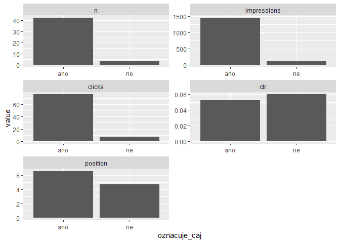
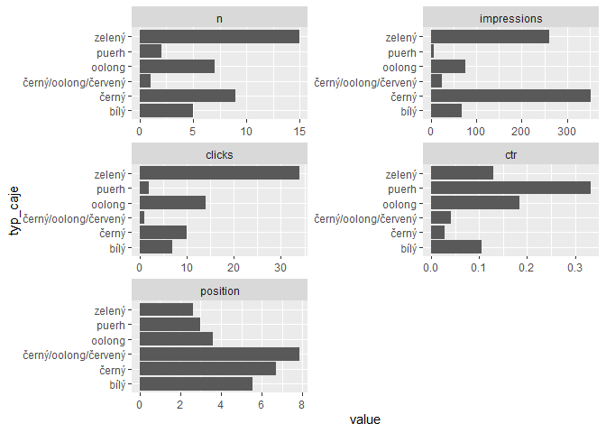
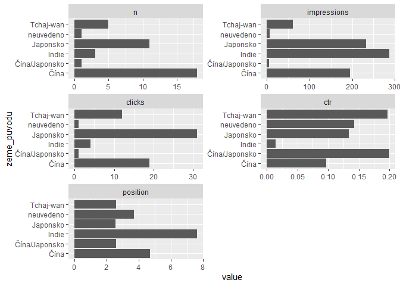

Klasifikace dotazů ze Search Console pomocí OpenAI API
================
Marek Prokop
5. 5. 2023

## Zadání úlohy

1.  Stáhnu data dotazů ze Search Console.
2.  Pomocí OpenAI dotazy zjednodušeně oklasifikuju a nasegmentuju.
3.  Metriky za segmenty dotazů nějak vizualizuju.

## Balíčky

Připojím potřebné balíčky.

``` r
library(tidyverse)
library(searchConsoleR)
library(openai)
library(janitor)
```

## Načtení dat ze Search Console

Autorizuju Search Console API.

``` r
scr_auth(email = Sys.getenv("MY_GOOGLE_ACCOUNT"))
```

Vyberu si účet, se kterým budu pracovat.

``` r
list_websites() |> 
  filter(str_detect(siteUrl, "cajtydne"))
```

Načtu dotazy ze Search Console.

``` r
queries <- search_analytics(
  siteURL = "https://www.cajtydne.cz/",
  startDate = today() - 16,
  endDate = today() - 3,
  dimensions = "query",
  dimensionFilterExp = "country==cze"
)

queries |> 
  slice_max(order_by = impressions, n = 10)
```

               query clicks impressions         ctr position
    1            cha      1         681 0.001468429 7.977974
    2     darjeeling      2         287 0.006968641 7.435540
    3         gaiwan      5         104 0.048076923 4.961538
    4        kukicha     10          77 0.129870130 3.376623
    5   dračí studna      0          76 0.000000000 4.618421
    6         oolong      0          75 0.000000000 6.186667
    7        hojicha     10          57 0.175438596 1.385965
    8     vodní víla      1          43 0.023255814 2.790698
    9  gruzínský čaj      0          43 0.000000000 7.930233
    10  pivoňka bílá      0          40 0.000000000 5.725000

## Klasifikace pomoci OpenAI API

Definuju šablonu promptu.

``` r
prompt_template <- read_lines("
Klasifikuj následující seznam vyhledávacích dotazů:

{queries}

U každého dotazu uveď, zda označuje čaj (ano/ne), a pokud ano, napiš typ čaje (černý, zelený, bílý, oolong, puerh) a zemi původu. Výsledky uspořádej do tabulky ve formátu CSV s hodnotami oddělenými čárkou.

Příklad:
dotaz,označuje čaj,typ čaje, země původu
dračí studna,ano,zelený,Čína
gaiwan,ne,,
zelený čaj,ano,zelený,
darjeeling,ano,černý,Indie
", skip = 1) |> 
  paste(collapse = "\n")

cat(prompt_template)
```

    Klasifikuj následující seznam vyhledávacích dotazů:

    {queries}

    U každého dotazu uveď, zda označuje čaj (ano/ne), a pokud ano, napiš typ čaje (černý, zelený, bílý, oolong, puerh) a zemi původu. Výsledky uspořádej do tabulky ve formátu CSV s hodnotami oddělenými čárkou.

    Příklad:
    dotaz,označuje čaj,typ čaje, země původu
    dračí studna,ano,zelený,Čína
    gaiwan,ne,,
    zelený čaj,ano,zelený,
    darjeeling,ano,černý,Indie

Připravím funkci, která rozdělí dotazy do skupin po n položkách.
Výsledek bude seznam (list) znakových vektorů. Na vzorku 45 dotazů
vyzkouším, zda funkce funguje.

``` r
split_vector <- function(x, n) {
  split(x, ceiling(seq_along(x) / n)) |> 
    map(paste, collapse = "\n")
}

queries$query |> 
  head(45) |> 
  split_vector(20)
```

    $`1`
    [1] "hojicha\nkukicha\nčaj týdne\ngaiwan\nčaj gaba\ngaba oolong\nútesový čaj\ndarjeeling\ngaba čaj účinky\nhojicha čaj\nhojicha čaj účinky\nkukicha čaj\nmatcha iri sencha\nutesovy caj\nyue guang bai\nzheng shan xiao zhong\nčaj kukicha\nbílá pivoňka čaj\ncha\nda hong pao"

    $`2`
    [1] "darjeeling margaret's hope\ndian hong gong fu\ndraci studna\ngaba caj\ngaba čaj\ngaiwan sada\ngong fu cha\nhohicha\njaponský čaj kukicha\nkukicha čaj účinky\nlisovaný čaj\nliu bao tea\nmi lan xiang\nnejlepší čaj\noolong gaba\npai mu tan\npivonka bila\nsencha matcha\nsilný zelený čaj\ntamaryokucha"

    $`3`
    [1] "tie guan yin\ntinderet\ntung ting\nutesovy čaj\nvodní víla"

Připravím funkci, která z jedné dávky dotazů a šablony sestaví prompt.

``` r
build_prompt <- function(queries, template) {
  str_glue(prompt_template, queries = queries)
}

queries$query |> 
  head(45) |> 
  split_vector(20) |> 
  pluck(1) |> 
  build_prompt(prompt_template)
```

    Klasifikuj následující seznam vyhledávacích dotazů:

    hojicha
    kukicha
    čaj týdne
    gaiwan
    čaj gaba
    gaba oolong
    útesový čaj
    darjeeling
    gaba čaj účinky
    hojicha čaj
    hojicha čaj účinky
    kukicha čaj
    matcha iri sencha
    utesovy caj
    yue guang bai
    zheng shan xiao zhong
    čaj kukicha
    bílá pivoňka čaj
    cha
    da hong pao

    U každého dotazu uveď, zda označuje čaj (ano/ne), a pokud ano, napiš typ čaje (černý, zelený, bílý, oolong, puerh) a zemi původu. Výsledky uspořádej do tabulky ve formátu CSV s hodnotami oddělenými čárkou.

    Příklad:
    dotaz,označuje čaj,typ čaje, země původu
    dračí studna,ano,zelený,Čína
    gaiwan,ne,,
    zelený čaj,ano,zelený,
    darjeeling,ano,černý,Indie

Vyzkouším si vytvoření více promptů pomocí funkce map. Zároveň zvolím
vhodnou podmnožinu dotazů, abych pak API nepouštěl úplně na všechny.

``` r
queries |> 
  filter(
    impressions >= 2,
    clicks > 0
  ) |> 
  pull(query) |> 
  split_vector(20) |> 
  map(build_prompt, template = prompt_template)
```

    $`1`
    Klasifikuj následující seznam vyhledávacích dotazů:

    hojicha
    kukicha
    čaj týdne
    gaiwan
    čaj gaba
    gaba oolong
    útesový čaj
    darjeeling
    gaba čaj účinky
    hojicha čaj
    hojicha čaj účinky
    kukicha čaj
    matcha iri sencha
    utesovy caj
    yue guang bai
    zheng shan xiao zhong
    čaj kukicha
    bílá pivoňka čaj
    cha
    da hong pao

    U každého dotazu uveď, zda označuje čaj (ano/ne), a pokud ano, napiš typ čaje (černý, zelený, bílý, oolong, puerh) a zemi původu. Výsledky uspořádej do tabulky ve formátu CSV s hodnotami oddělenými čárkou.

    Příklad:
    dotaz,označuje čaj,typ čaje, země původu
    dračí studna,ano,zelený,Čína
    gaiwan,ne,,
    zelený čaj,ano,zelený,
    darjeeling,ano,černý,Indie

    $`2`
    Klasifikuj následující seznam vyhledávacích dotazů:

    darjeeling margaret's hope
    dian hong gong fu
    draci studna
    gaba caj
    gaba čaj
    gaiwan sada
    gong fu cha
    japonský čaj kukicha
    kukicha čaj účinky
    lisovaný čaj
    liu bao tea
    nejlepší čaj
    pai mu tan
    pivonka bila
    sencha matcha
    silný zelený čaj
    tamaryokucha
    tie guan yin
    vodní víla
    vonící orchidej

    U každého dotazu uveď, zda označuje čaj (ano/ne), a pokud ano, napiš typ čaje (černý, zelený, bílý, oolong, puerh) a zemi původu. Výsledky uspořádej do tabulky ve formátu CSV s hodnotami oddělenými čárkou.

    Příklad:
    dotaz,označuje čaj,typ čaje, země původu
    dračí studna,ano,zelený,Čína
    gaiwan,ne,,
    zelený čaj,ano,zelený,
    darjeeling,ano,černý,Indie

    $`3`
    Klasifikuj následující seznam vyhledávacích dotazů:

    ya bao
    zelený čaj dračí studna
    zlaty caj
    čaj darjeeling
    čaj dračí studna

    U každého dotazu uveď, zda označuje čaj (ano/ne), a pokud ano, napiš typ čaje (černý, zelený, bílý, oolong, puerh) a zemi původu. Výsledky uspořádej do tabulky ve formátu CSV s hodnotami oddělenými čárkou.

    Příklad:
    dotaz,označuje čaj,typ čaje, země původu
    dračí studna,ano,zelený,Čína
    gaiwan,ne,,
    zelený čaj,ano,zelený,
    darjeeling,ano,černý,Indie

Vytvořím funkci pro volání OpenAI API a zavolám API se všemi prompty.
Výsledek uložím do objektu `ai_answer` a ten si pak uložím na disk do
složky `data`, abych při opakovaném spouštění nevolal placené API
zbytečně znovu.

``` r
call_ai <- function(prompt) {
  response <- openai::create_chat_completion(
    model = "gpt-3.5-turbo",
    max_tokens = 2000,
    temperature = 0,
    messages = list(list(
      "role" = "user",
      "content" = prompt
    ))
  )
  response$choices$message.content
}

ai_answer_file_path <- "data/ai_answer.rds"

if (file.exists(ai_answer_file_path)) {
  ai_answer <- read_rds(ai_answer_file_path)
} else {
  ai_answer <- queries |> 
    filter(
      impressions >= 2,
      clicks > 0
    ) |> 
    pull(query) |> 
    split_vector(20) |> 
    map(build_prompt, template = prompt_template) |> 
    map(call_ai)
  
  ai_answer |> write_rds(ai_answer_file_path)
}
```

Z dat Search Console a odpovědi API vytvořím kompletní dataframe dotazů
s metrikami i klasifikací.

``` r
classified_queries <- queries |> 
  left_join(
    ai_answer |> 
      map(read_csv) |> 
      list_rbind() |> 
      janitor::clean_names() |> 
      mutate(across(typ_caje:zeme_puvodu, \(x) na_if(x, ","))),
    by = join_by(query == dotaz)
  )
```

Prozkoumám výsledky

``` r
classified_queries |> 
  filter(!is.na(oznacuje_caj)) |> 
  slice_sample(n = 10)
```

                         query clicks impressions         ctr position oznacuje_caj
    1     japonský čaj kukicha      1           4 0.250000000 2.000000          ano
    2                      cha      1         681 0.001468429 7.977974          ano
    3          gaba čaj účinky      2          12 0.166666667 1.000000          ano
    4               pai mu tan      1          28 0.035714286 8.000000          ano
    5                   ya bao      1           4 0.250000000 1.000000          ano
    6  zelený čaj dračí studna      1           2 0.500000000 7.000000          ano
    7              gong fu cha      1          21 0.047619048 7.476190          ano
    8             tamaryokucha      1          13 0.076923077 2.230769          ano
    9             draci studna      1          17 0.058823529 2.764706          ano
    10            pivonka bila      1          24 0.041666667 5.458333          ano
                   typ_caje zeme_puvodu
    1                zelený    Japonsko
    2                  <NA>        <NA>
    3                oolong   Tchaj-wan
    4                  bílý        Čína
    5                  bílý        Čína
    6                zelený        Čína
    7  černý/oolong/červený        Čína
    8                zelený    Japonsko
    9                zelený        Čína
    10                 bílý        Čína

``` r
classified_queries |> count(oznacuje_caj, sort = TRUE)
```

      oznacuje_caj   n
    1         <NA> 448
    2          ano  42
    3           ne   3

``` r
classified_queries |> count(typ_caje, sort = TRUE)
```

                  typ_caje   n
    1                 <NA> 454
    2               zelený  15
    3                černý   9
    4               oolong   7
    5                 bílý   5
    6                puerh   2
    7 černý/oolong/červený   1

``` r
classified_queries |> count(zeme_puvodu, sort = TRUE)
```

        zeme_puvodu   n
    1          <NA> 454
    2          Čína  18
    3      Japonsko  11
    4     Tchaj-wan   5
    5         Indie   3
    6     neuvedeno   1
    7 Čína/Japonsko   1

## Vizualizace

Chci postupně zobrazit grafy pro všechny tři klasifikační dimenze. Abych
se neopakoval, napíšu si na to funkci.

``` r
plot_queries <- function(queries, variable) {
  queries |> 
    group_by({{variable}}) |> 
    summarise(
      n = n(),
      position = weighted.mean(position, impressions),
      impressions = sum(impressions),
      clicks = sum(clicks),
      ctr = clicks / impressions
    ) |> 
    relocate(position, .after = ctr) |> 
    pivot_longer(-{{variable}}, names_to = "metric") |> 
    mutate(metric = as_factor(metric)) |> 
    ggplot(aes(x = {{variable}}, y = value)) +
    geom_col() +
    facet_wrap(vars(metric), scales = "free", ncol = 2)
}
```

``` r
classified_queries |> 
  filter(!is.na(oznacuje_caj)) |> 
  plot_queries(oznacuje_caj)
```



``` r
classified_queries |> 
  filter(!is.na(typ_caje)) |> 
  plot_queries(typ_caje) +
  coord_flip()
```



``` r
classified_queries |> 
  filter(!is.na(zeme_puvodu)) |> 
  plot_queries(zeme_puvodu) +
  coord_flip()
```


